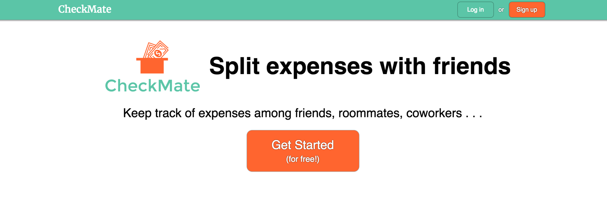
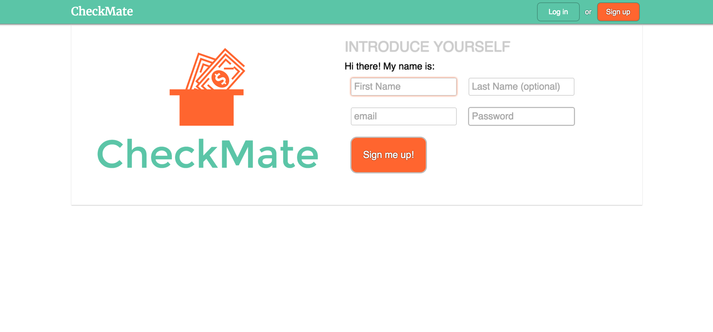
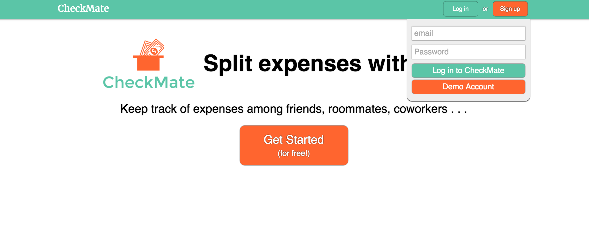
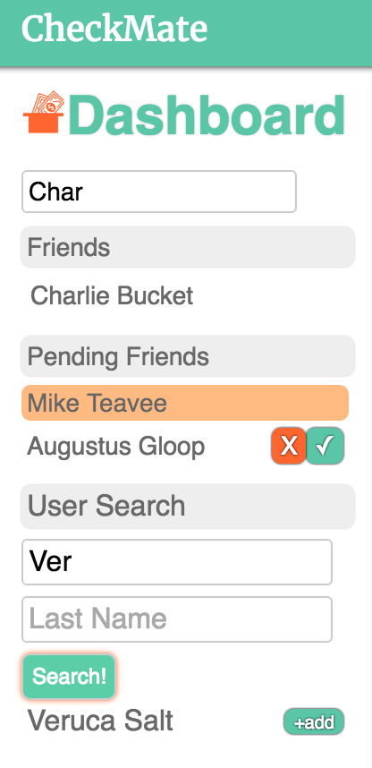
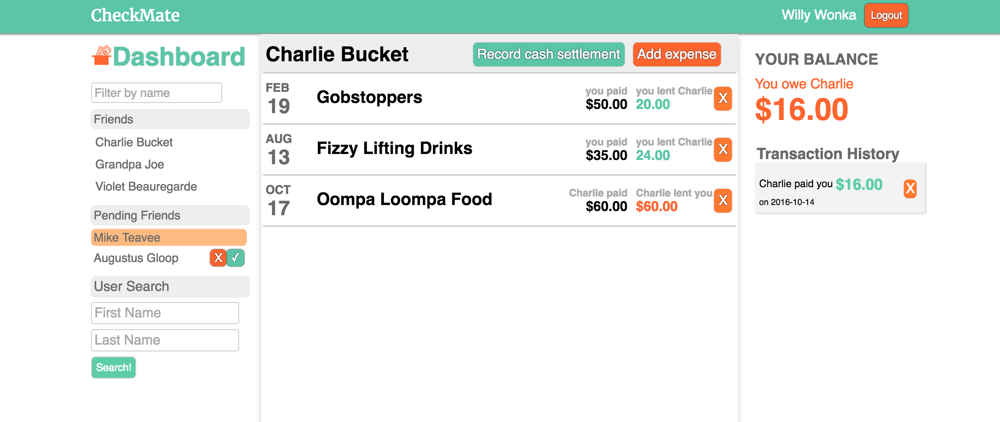
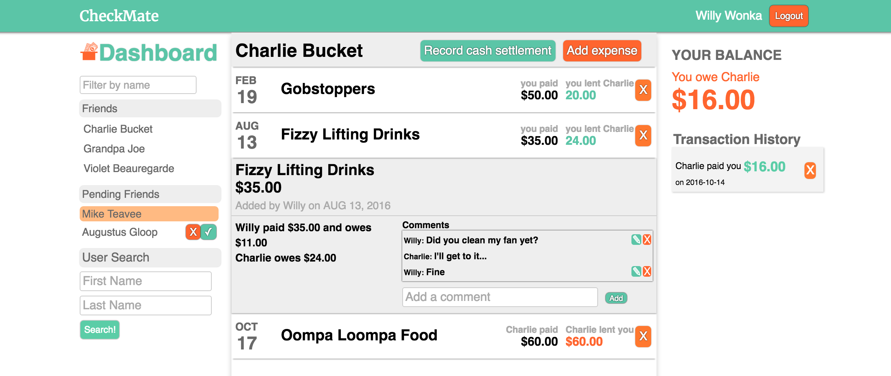
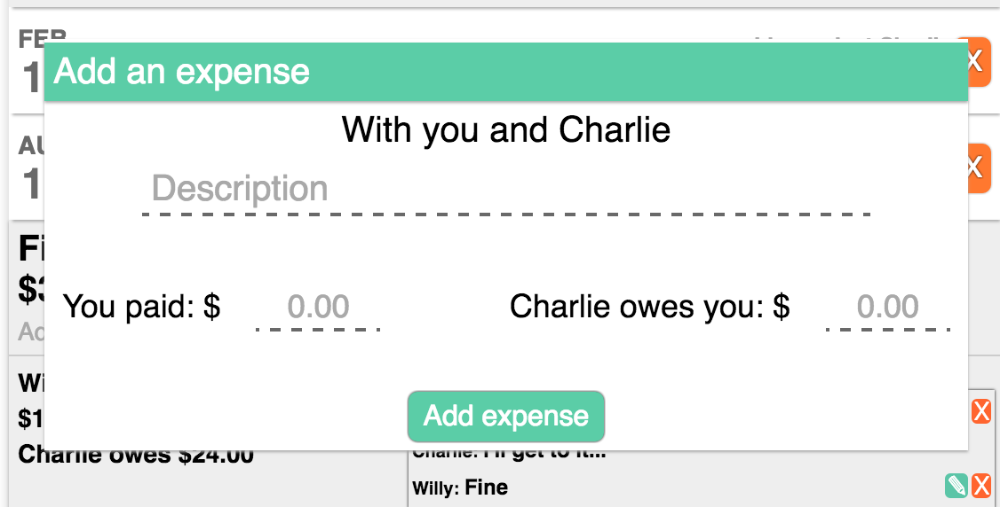
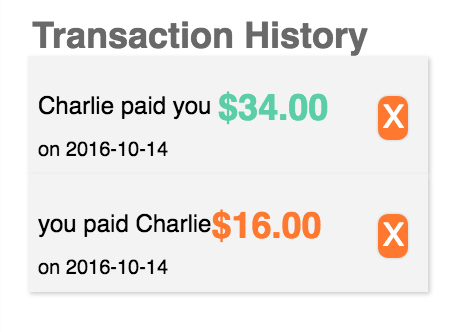
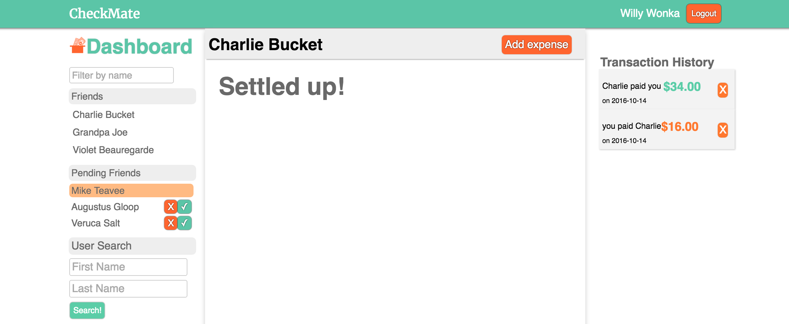
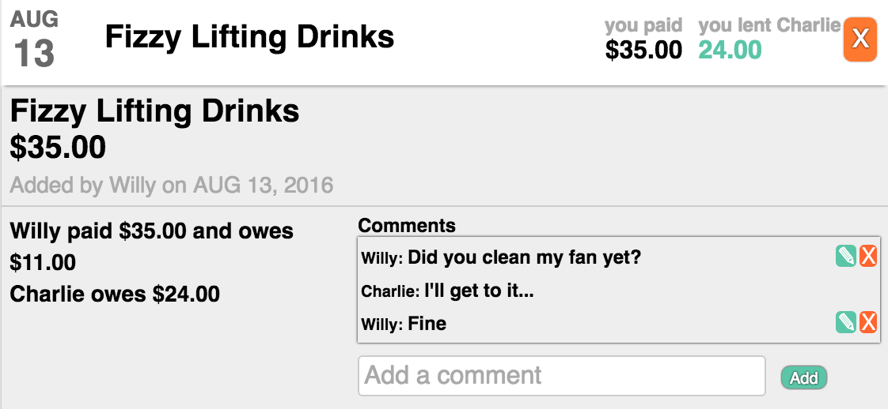

## CheckMate
[CheckMate live](https://checkmate-bm.herokuapp.com/)

CheckMate is a full-stack web application inspired by Splitwise. It is built with Ruby on Rails on the back end, a PostgrSQL database, and React/Redux front end architectural framework.

### Authorization

Users of CheckMate create accounts using their email, first name, and can optionally include their last name. All accounts are created and sessions are validated using the BCrypt gem for encryption.

### Friending

Users have the ability to add friends that they can share expenses with. All of the user's current friends are filterable using a text input field. Each friend in the list is a link to the expense pane for that friend, which will display a list of all unsettled expenses currently being shared wit that friend. When a friend request is sent, it will appear highlighted in their pending friend requests list until the other user accepts or declines. Requests to the current user will also be displayed here, with buttons to either accept or deny the request. Users can be searched for using a case insensitive search form by first name, last name, or both. Note that on the main dashboard page, the current balance will be displayed for all friends with open balances.

### Expense Sharing

Users have the ability to share expenses with their friends. Each expense includes a description, expense total, and the amount that each user owes toward that expense. The application enforces that all expense shares and the amount the payer owes sum to the expense total. More specific details for each expense can be viewed by clicking on the expense description. Expenses can be deleted by any user involved in that expense.

### Transactions

Balances can be settled by recording a cash transaction. Doing so will mark all currently open expense shares between the current user and friend as settled. A transaction history is shown on the right side of the screen. Transactions can be deleted by either user involved. For example, a user may have not actually paid up but recorded a cash transaction, prompting the "receiver" of this payment to want to delete it. Doing so will re-open all expense shares that were marked as settled at the time the transaction was recorded.

### Comments

The expense details include a comments section. Users involved in each expense have the ability to add comments. Users can also edit or delete any comments they previously left on an expense.

## Features to be added

### Expense sharing between more than two users

Currently, users can only share expenses between themselves and one other friend. The back end architecture is in place for this behavior, so updating the expense submit form will be updated to allow the user to indicate everyone involved in the expense, what their share's are, who paid, and the date of the expense.

### Groups

Friends will be able to create and join groups. All expenses in a group are visible to all members of the group, even if the individual user was not involved in a specific expense. Additionally, debts within groups can be simplified to reduce the total number of transactions. For example, if Alice owes Bob $10 and Bob owes Carol $10, Alice can pay Carol $10 to settle all balances within the group in a single transaction.
